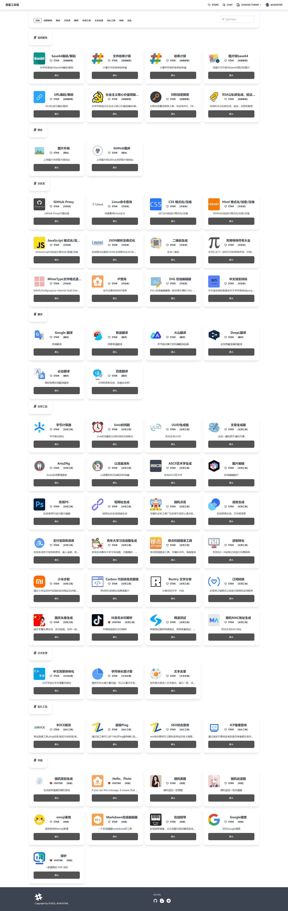
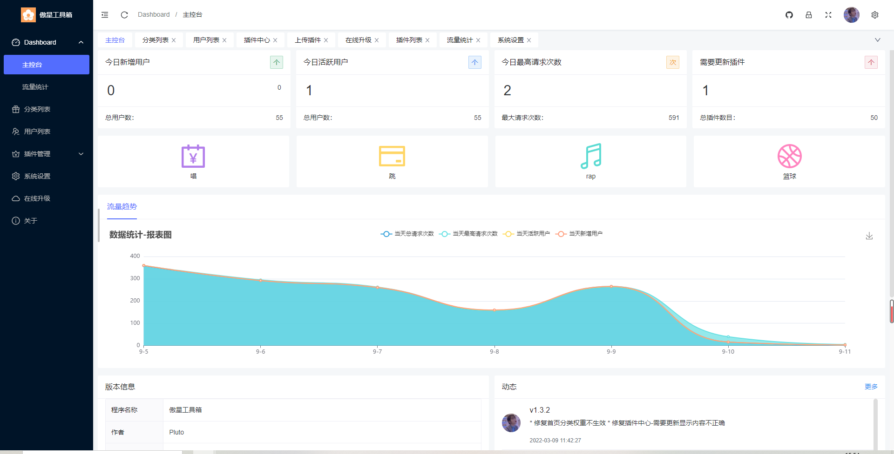
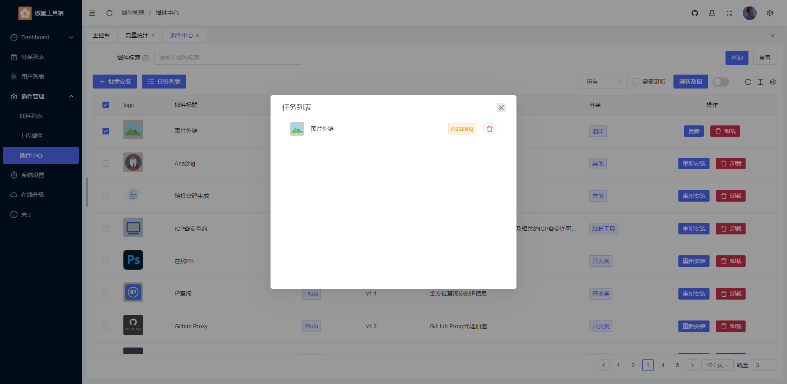
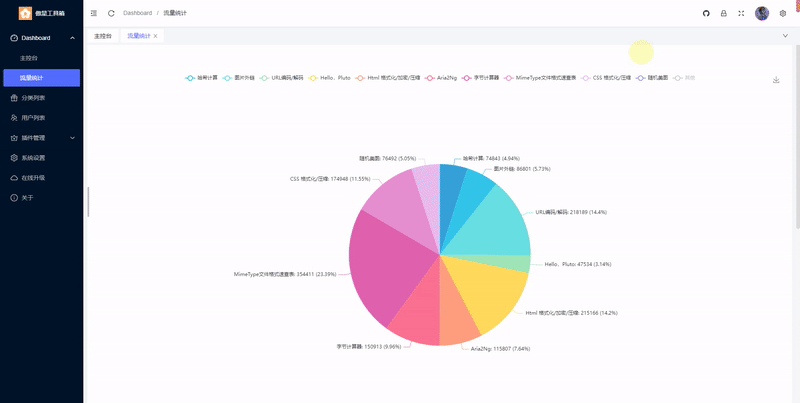
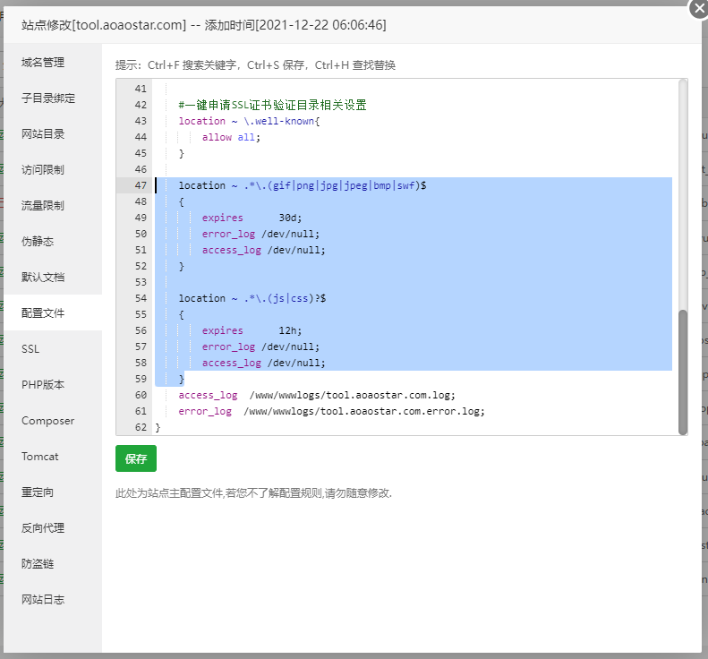

### 🎉 What's this？

这是一款`在线工具箱`程序，您可以通过安装扩展增强她的功能  
通过插件模板的功能，您也可以把她当做网页导航来使用~    
觉得该项目不错的可以给个`Star`~

### 😺 演示地址

* <https://tool.aoaostar.com>

### 🍹 演示图






## 🎑 说明

> 严禁用于非法用途

### 😺 文档

[插件编写](docs/Plugin.md)  
[Github Oauth 配置](docs/Github_Oauth.md)     
[Plugin Template 使用](docs/Plugin_Template.md)      
[Plugin Permission 使用](docs/Plugin_Permission.md)
[站点地图 Sitemap 使用](docs/Sitemap.md)

#### 演示搭建视频
* <https://www.bilibili.com/video/BV12g411z7KL>

### 🎊 环境要求

* `PHP` >= 7.2.5
* `MySQL` >= 5.7
* `fileinfo`扩展
* 使用`Redis`缓存需安装`Redis`扩展
* 去除禁用函数`proc_open`、`putenv`、`shell_exec`、`proc_get_status`(
  必须是命令行的PHP版本，你装了多个PHP版本，命令行版本的PHP和你的网站配置的PHP可能不是同一个，嫌麻烦可以下载`full`包)

### 🚠 部署

1. 下载`Release`代码
2. 设置运行目录为`public`
3. 关闭防跨站（`open_basedir`）
4. 设置伪静态
5. 去除静态文件代理
    + 打开`nginx`配置
    + 删除图中选中的内容
      

6. 安装依赖
   > `full`包，已安装依赖，无需重复安装
    + 配置阿里镜像源
      ```
      composer config -g repo.packagist composer https://mirrors.aliyun.com/composer/
      ```
    + 升级compose
      ```
      composer self-update
      ```
    + 安装依赖
      ```
      composer install --no-dev
      ```
7. 设置目录权限

    + 一般是默认允许的（如有无法上传、无法打开页面或其他未知问题可以设置一下目录权限）
    + `Apache`的所属组为`www-data`，那么就请修改`www`为`www-data`

      ```shell script
      chmod -R 755 *
      chown -R www:www *
      ```

8. 打开`你的域名/install`

#### 🍰 伪静态

* Nginx

```
location / {
	if (!-e $request_filename){
		rewrite  ^(.*)$  /index.php?s=$1  last;   break;
	}
}
```

* Apache

```
<IfModule mod_rewrite.c>
  Options +FollowSymlinks -Multiviews
  RewriteEngine On
  RewriteCond %{REQUEST_FILENAME} !-d
  RewriteCond %{REQUEST_FILENAME} !-f
  RewriteRule ^(.*)$ index.php/$1 [QSA,PT,L]
</IfModule>
```

### 😊 donate


#### 🍓 鸣谢

* [thinkphp](https://github.com/top-think/framework)
* [Vue.js](https://github.com/vuejs/vue)
* [daisyUI](https://github.com/saadeghi/daisyui)
* [tailwindcss](https://github.com/tailwindlabs/tailwindcss)
* [Naive Ui](https://github.com/tusen-ai/naive-ui)
* [Naive Ui Admin](https://github.com/jekip/naive-ui-admin)
